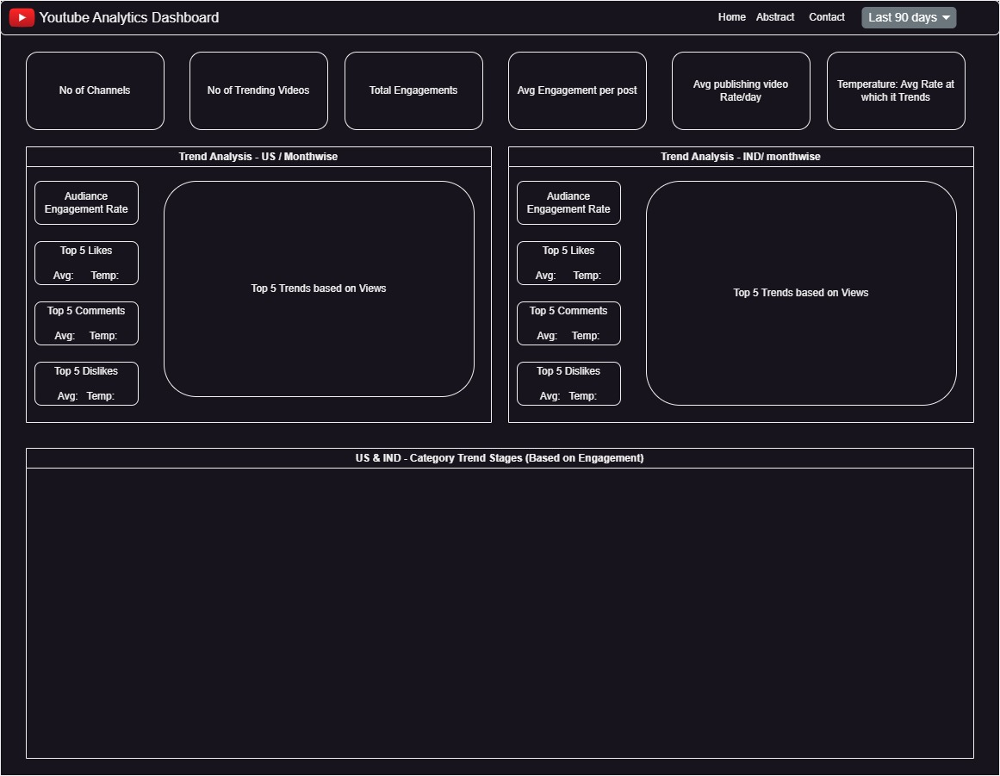

# Youtube Analytics
I have worked on challenge to create a dashboard using Dash. We have used the youtube data for two regions India and US for this use case. 

Two Tabs are Created
- Trending
- Analytics

Trending aims to balance all of these considerations. To achieve this, Trending considers many signals, including (but not limited to):
1. View count
2. How quickly the video is generating views (i.e. “temperature”)
3. Where views are coming from, including outside of YouTube
4. The age of the video.
5. How the video performs compared to other recent uploads from the same channel

## KPI's 
- No. of Channels
- No. of Subscribers
- No. of Trending Videos Published
- Subscribers Gained
- Subscribers Lost

## Engagement KPI
- No. of Views
- Avg. daily Views
- Avg Videos Created per day/ Channel
- Daily Active Content Creator

## Trending KPI
- Top 3 Trending Segments
- Overall Trending %
- Avg View of Trending Videos
- Avg Likes of Trending Videos
- Avg Comments of Trending Videos
- Avg Length of Trending Videos

## Content Creators KPI
- Trend Success Ratio of ACC.
- Top 3 Content Creator Trending

## TOP 3 Analysis - KPI for Increasing Brand Awareness
1. Increase brand awareness
    - Article Views
    - Social Shares
    - Audience Engagement (Views - Likes & Comments)
    - Inbound links - to other video
    - Follower/ Subscriber Growth

2. Generate more leads
    - Instragram, Twiter, FB links
    - No of Subscribers

3. Increase conversions
    - Conversion Rate

4. Boost engagement
    - Avg Video length
    - Social media likes, comments, shares
    - Follower growth on social media over time
    - Avg Time on video/channel

## Dashboard Wireframe

